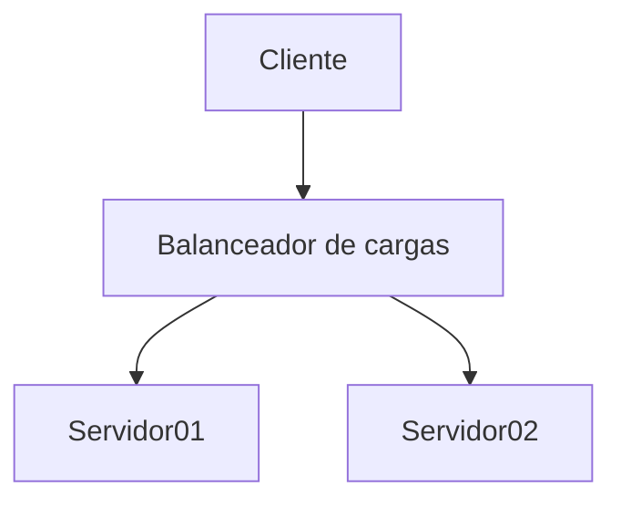
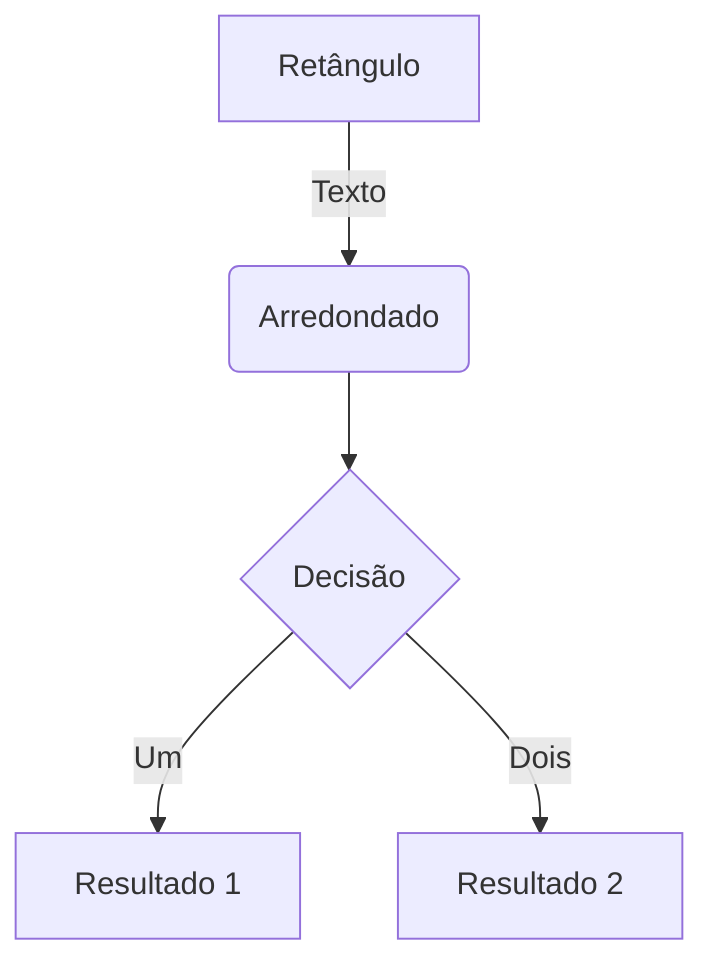

# Ensaio de fluxogramas

## Balanceador de cargas

```mermaid
graph TD
A[Cliente] --> B[Balanceador de cargas]
B --> C[Servidor01]
B --> D[Servidor02]
```

## Fluxograma

```mermaid
graph TD
A[Retângulo] --> |Texto| B(Arredondado)
B --> C{Decisão}
C --> |Um| D[Resultado 1]
C --> |Dois| E[Resultado 2]
```
