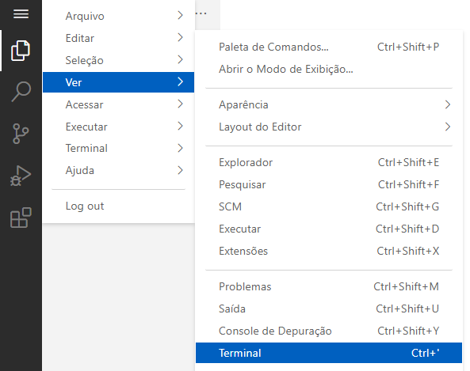

# Documentação para Aplicações de Redes de Computadores

Para editar as páginas deste site, visite:

- **URL:** <http://192.168.56.20:8080/?folder=/home/estudante/app-redes/>
- **Senha:** 21635835357daa17729435c3

Para atualizar a versão HTML delas, abra um terminal e execute o comando:

- `mkdocs build`

Finalmente, recarregue esta página ou visite novamente <http://192.168.56.20:8080/>.
